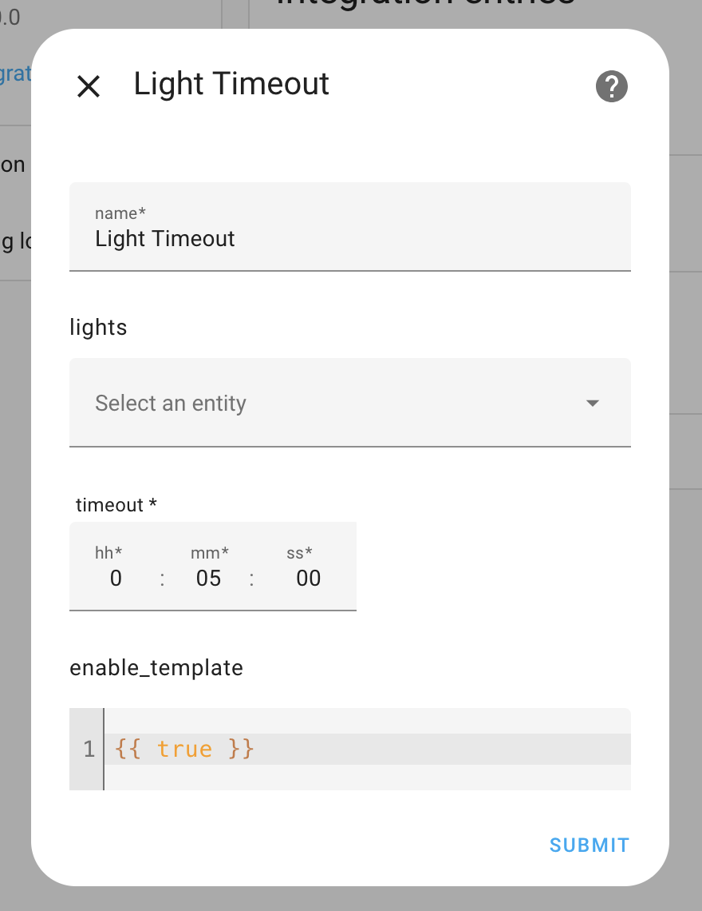

# Auto Off Timer

A Home Assistant custom integration that automatically turns off configured entities after a user-defined timeout—optionally gated by custom Jinja2 template conditions. When an entities is turned on and the user-specified condition evaluates to `true`, a timer starts; when the timer expires the entities is switched off. The timer is cancelled if the entities is manually turned off or renewed if some attribute is modified (e.g., brightness change). Each entities has its own independent timer. *Timers are persisted, if Home Assistant is restarted, the timers will be restored*.

## Features

- Starts an individual timer whenever a configured entity is turned on
- Automatically turns off the entity when the timeout expires
- Cancels the timer if the entity is manually turned off
- Renews the timer if the entity’s state is modified while on
- Supports multiple entities simultaneously, each with its own timeout
- Condition via Template: define any Jinja2 template that must evaluate to `true` to enable/disable the timeout

## Installation

### HACS (Recommended)

1. Make sure [HACS](https://hacs.xyz/) is installed in your Home Assistant.
2. Add this repository as a custom repository in HACS:
   - Go to **HACS → Integrations → ⋮ → Custom repositories**
   - Paste the URL `https://github.com/0x3333/auto_off_timer`
   - Select the category **Integration**
3. Click **Download** to install
4. Restart Home Assistant

### Manual Installation

1. Copy the `auto_off_timer` folder into `custom_components/auto_off_timer` in your Home Assistant configuration directory.
2. Restart Home Assistant

> **Note:** You do not need to edit `configuration.yaml` — all configuration is done through the UI (Config Flow).

## Configuration

After installation and restart:

1. Go to **Settings → Devices & Services → Integrations**.
2. Click **Add Integration** and search for **Auto Off Timer**.
3. Fill out the form:
   - **Name**: a friendly title for this instance (e.g., “Living Room Timeout”).
   - **Entities**: select one or more entities to monitor.
   - **Timeout**: choose a timeout duration in `HH:MM:SS` format (e.g., `00:10:00` for 10 minutes).
   - **Condition Template** *(optional)*: enter a Jinja2 template that will be evaluated after the entity is turned `on`. The timer will only be started if the template renders `true`.
4. Click **Submit**.

The integration will begin monitoring the selected entities. You can create as many instances (Config Entries) as you like, each with its own set of entities, timeout and condition.

## Entities

This integration **does not** create any new entities. All behavior is handled via state listeners and native service calls (`DOMAIN.turn_off`).

## Contributing

Contributions are welcome! Feel free to open a **Pull Request** or file **Issues** in the official repository.

1. Fork this repository.
2. Create a branch (`git checkout -b feature/new-feature`).
3. Commit your changes (`git commit -m 'Add new feature'`).
4. Push to the branch (`git push origin feature/new-feature`).
5. Open a Pull Request.

## License

This project is licensed under the **MIT License**. See the [LICENSE](./LICENSE) file for details.
